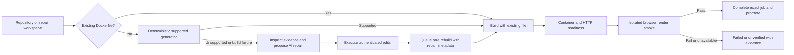

# AI service and deployment reliability audit — 2026-09-27

This is a source audit, implemented repairs, and local qualification of the running StackPilot stack. It does **not** certify arbitrary website coverage, independent subagents, continuous monitoring, or uniformly smooth 60 FPS. Earlier browser audit documents describe additional work and historical measurements.

## Confirmed failures and repairs

| Failure | Evidence | Implemented change |
| --- | --- | --- |
| Green deployment with a blank React page | The club-website runtime served `index.html` referencing `/src/main.tsx`; its generated Nginx image copied raw source. HTTP returned 200. | A package manifest takes precedence over a root HTML file. Static SPA Dockerfiles build the application, require a known output containing `index.html`, and copy compiled output only. Preserve repository Dockerfiles. Require `npm ci` when a lockfile exists; do not silently bypass its failure. The SPA template uses Node 22. |
| Repair claimed success without a deployment | Tool names and running status were treated as proof; an accumulator used for repair recovery was not initialized/populated consistently. | Initialize and record executor results. Derive repair success from successful writes, the latest queued job ID, completed status for that exact job, and stored browser render evidence. Queueing, editing, or narration alone never verifies repair. Automatically wait when a model stops after queueing a job without waiting. |
| REST repair had a second executor and a queue race | It omitted authenticated identity/project/deployment from the AI request, replayed proposed file edits, made another deployment, and assigned repair metadata after enqueue. A worker could re-clone before metadata arrived. | Supply authenticated context. Remove duplicate file replay, fallback Dockerfile generation, new-deployment creation, and the second enqueue. Record the actual executor job. Check its current database identity and verification before returning success. Extend the repair client timeout independently of short planning requests. |
| HTTP/container health hid frontend failures | A container and HTTP 200 can serve empty HTML, uncompiled source, or missing JS. | A bounded, isolated browser render gate observes ready state, visible content, source module entrypoints, HTTP failures and same-origin script/CSS failures. Store evidence on the build job. Fail promotion if the check fails or is unavailable. Apply the gate to queued builds and direct local Docker/HTTP Compose/Kubernetes deployment routes. A TCP Compose service is explicitly not browser-verified. |
| Old deployment could satisfy a new repair wait | Waiting inspected only deployment status; automatic healing searched for any newer running project deployment. | Match exact job IDs and completed status; superseded jobs return unverified. Automatic healing additionally matches the repair session and browser evidence. Status tools expose job identity and render verification. |
| Concurrent builds and source mutations collided | Shared source directories/container identities were mutable during rebuilds. | Serialize enqueue against the deployment row; reject a second active job. Reject workspace write/edit operations while that deployment has an active build. Strengthen canonical workspace containment checks. |
| Rollback advertised a healthy runtime from metadata | Generic rollback accepted a built-only checkpoint and copied its runtime fields without starting or checking it. | Only reuse a running checkpoint with the same provider after a fresh browser render check; describe this as reuse of an existing runtime. This is not a blue/green artifact rollout implementation. |
| Actions appeared only after a large batch finished | Nested actions and site audit cases had no incremental execution event; React did not immediately publish every tool result. | Emit request-local `tool_step` events with a unique ID and parent ID after each nested action. Capture that step's fresh screenshot before the next action. Forward/store events in C++, display them immediately, and expand the current screenshot while generating. Match parent results by call ID. Keep batching for fewer planner round trips. |
| Browser resource accumulation degraded playback | 17 old tabs, approximately 321% CPU and 2.08 GiB in the browser container despite no active viewer. | Restarted the confirmed idle worker; add a configurable four-session cap, last-use tracking, idle cleanup and shutdown disposal. Active runs, busy tools and viewers are protected from idle cleanup. Serialize browser operations per session. Capture/encode only on viewer demand. Local AI port is bound to loopback. |
| Provider stalls froze the agent | A real model run exceeded 100 s without response headers; cancellation left an unobserved task. A tiny completion also timed out, while the model catalogue returned 200 in 0.18 s. | Bound header wait and stream idle reads to 30 s by default; reap the request task on timeout, stop and caller cancellation. Report provider failure as unverified. Do not start another synthesis request after the same failed provider call. The provider availability problem is not fixed by this application-side timeout. |
| Advertised subagents were not independent executors | `invoke_subagent` does not dispatch an independent agent. Some status chips and instructions presented these roles as completed work. | Mark unsupported execution as failed, describe architecture/edit/verification as phases of the current agent, and remove synthetic phase announcements based merely on the presence of any tool call. Actual independent workers remain future work. |
| Repair prompts rewarded bypassing failures | Instructions required Dockerfiles for pure libraries/desktop apps and suggested commands ending in `|| true`. | Require an observed build and runtime entrypoint, retain unsupported-runtime failures, and prohibit swallowing build errors or disabling required tests. Bound repair workspace inspection, skip dependency/cache trees and symlinks, and omit private `.env` contents from manifest excerpts. |

## Deployment contract now enforced

The render gate is deliberately a **smoke check**. A page with a visible error screen, loading indicator, or broken business logic can still need additional tests. Assertions for required routes, API data, login, checkout, navigation and content must come from a task contract or application-specific test specification. The system must report untested pages and blocked actions. Generic discovery does not prove exhaustive business correctness.

## Local evidence

| Check | Result |
| --- | --- |
| Full C++ backend compile | Passed after controller, generator, job queue and client changes. |
| C++ unit tests | 194 passed, 0 failed; includes package-over-HTML precedence, compiled output, lockfile install and repository Dockerfile preservation. |
| Python deterministic tests | 167 discovered; 116 executed and passed, 51 live-browser cases skipped in this run. Includes incremental step delivery **before** the outer batch is allowed to finish, identity/isolation, repair evidence and request cancellation. |
| Opt-in live browser suites | 54 passed in 93.1 s, including real actionability, stale references, overlays, dynamic controls, assertions, site discovery and browser isolation. An additional live screenshot test passed in 1.65 s: the first screenshot/event arrived while only the checkbox was changed; the second arrived after typing the email. |
| Frontend unit tests | 98 passed. Existing jsdom network warning output is not a test failure. |
| Frontend TypeScript check | Passed. |
| Live platform integration | 58 passed, 0 failed: liveness, authentication, SSRF guard, scopes, permissions, confidential secret listing, organization access, previews, AI settings and migration ledger. |
| Browser render fixtures | HTTP-200 uncompiled TS: rejected in 602 ms; HTTP-200 blank body: rejected in 5.52 s; working content: passed in 522 ms; missing script: rejected in 583 ms. Owned sessions were closed. |
| Real club-website rebuild | Passed in 8.30 s with cached dependencies. Exact job `6ccae024-c740-4bab-82b3-d00281e5dc64`; runtime `http://localhost:63640` at that time. Duplicate enqueue, source edits during build and an unrelated job wait were rejected. A later qualification rebuild may change the published port. |
| Final installed backend rebuild | Passed in 20.50 s while the local stack was restarting/compiling. Exact job `225a7dea-9aea-40ba-bcb1-1286fb12c697`, runtime `http://localhost:63910` at that time. Both warm samples are observations, not a fixed latency guarantee. |
| Final status-contract qualification | Passed in 4.19 s without compile/restart load. Exact job `f81b78e7-c34b-4ffb-8dca-5ebbbff3e19a`, runtime `http://localhost:54735`. Also verified that `get_deployment_status` exposes the same completed job and render smoke evidence. |
| Initial cold rebuild | Exceeded the test's initial 180 s wait while pulling Node 22 and installing dependencies. Correctly returned unverified/building, then completed and passed the render gate. The integration test now allows 600 s. Cold builds are not an 8 s guarantee. |
| Real-provider browser task | Failed: no headers within the original 100 s smoke deadline, no checkbox/email mutations. With the repair, explicit GPT-OSS-20B returned a controlled unverified timeout after 30.39 s, with no dangling-task warning. No current real-model success is claimed. Historical successful samples are not proof of present provider availability. |

The repaired club workspace Dockerfile and `.dockerignore` were updated locally; the previous Dockerfile is backed up in `backups/ai-service-audit-runtime/`. The refreshed local backend image uses the compiled binary; the original image is retained as `stackpilot-backend:audit-before`. No repository commit or cloud deployment was performed.

Compose exposes the stream deadlines, browser capacity, idle TTL and planner/fallback model settings. Production default model names now match the tool-capable local planner rather than the old retired aliases. Existing environment overrides are preserved. This does not certify inference availability; a model change requires qualification with the actual provider and workload.

### Streaming qualification

After idle resource cleanup, the actual React viewer, AI WebSocket, encoder and disposable Chromium page passed changing-pixel animation, native click feedback, route/title synchronization, empty title clearing, full navigation, reconnect and forced decoder failure.

| Path | Visible presentation callbacks | Rate | p95 callback gap |
| --- | --- | --- | --- |
| H.264 native video | 68 in approximately 4.2 s | 16.26 FPS | 116.7 ms |
| Reconnected video | 75 | 17.95 FPS | 83.4 ms |
| Forced JPEG fallback | 65 | 16.04 FPS | 115.7 ms |

Route/title synchronization took 292.56 ms in this sample. Idle browser usage after cleanup was approximately 0.13% CPU and 332 MiB. These are short local software-rendered measurements, not a production load test or a measurement in a normal GPU-accelerated user browser. Frames submitted/decoded were much higher than visible callback counts. They must not be marketed as smooth 60 FPS. Earlier streaming documents contain historical submitted-frame measurements; this callback-based table is the current qualification.

## Remaining work before an industry-grade claim

1. **Restore and qualify provider inference.** Model discovery is not an inference health check. Add a provider capability/latency qualification suite and explicitly configured, tested fallback lanes. Record time to first token, planner time, tool time and end-to-end correctness separately. A backend rewrite cannot remedy an unavailable remote inference service.
2. **Isolate browser workers completely.** Context isolation protects cookies/storage, but the local X11 display has one foreground video owner. Use one display/browser process per active worker, resource quotas, queue admission, and durable task ownership before multi-tenant deployment. Four local contexts is admission control, not OS isolation.
3. **Authenticate viewer and takeover operations.** Issue short-lived owner-bound tickets through the backend and validate them on WebSocket acceptance and reconnect. HTTP service-token middleware does not establish WebSocket ownership. Loopback publishing reduces local exposure; it does not implement a multi-tenant authorization boundary. Production reverse proxy exposure must remain restricted until tickets exist.
4. **Promote immutable candidate artifacts.** Build from a source snapshot, deploy a candidate under a new identity, verify it, then switch the stable route and drain the prior runtime. The current local Docker rebuild can replace the old container before the new runtime passes. Add transactional promotion, leases/idempotency keys, crash reconciliation and real artifact rollback. The repaired pointer-reuse rollback is not a substitute.
5. **Durable repair execution.** REST and SSE share the executor facts now, but long repair orchestration still needs a durable job/run with status retrieval, cancellation and reconnectable events. Queue ownership, source revisions and promotion evidence should live in PostgreSQL. Independent subagent execution needs real tasks, constrained tools and independently observed outcomes, not role names.
6. **Qualify accuracy across tasks.** Add a versioned corpus for navigation, forms, delayed controls, popups, uploads/downloads, authentication, redirects, cross-origin frames and destructive actions. Use independent postconditions, repeated trials and failure categorization. Include provider outages, tab crashes, encoder failure and worker restarts. A simple 'test this website' can discover and exercise safe reachable controls, but cannot infer every business requirement or bypass permissions/CAPTCHAs.
7. **GPU streaming migration.** The existing GPU Dockerfile/entrypoint are not a qualified production worker: Xvfb and a GPU encoder alone do not prove GPU rendering, and the older GPU streamer must receive the same queue/recovery rules. Validate actual Chromium GPU acceleration, NVENC use, bounded frame age, hardware client decoding, worker isolation, network loss and reconnect. Prefer a measured WebRTC transport for adaptive video. Use Spot draining/checkpointing and On-Demand fallback if session continuity matters.
8. **Storage and operational budgets.** Move screenshots/video to access-controlled object storage with retention, keep small event references in the database, and enforce per-run costs and quotas. Bound safe crawl scope and clearly distinguish passed, failed, blocked, unverified and untested outcomes. Audit remote runtime, rollback and deployment routes with dedicated fixtures; compiling them is not live qualification.

## Reproduce

Commands are documented in `tests/README.md`. Relevant new scripts:

- `tests/integration/runtime_render_smoke.py`: disposable HTTP browser render cases.
- `tests/integration/deployment_repair_smoke.py DEPLOYMENT_ID`: opt-in **real rebuild** and admission/identity checks; use a project you authorize rebuilding.
- `tests/integration/browser_agent_model_smoke.py`: opt-in provider call and independent fixture outcome; `MODEL_SMOKE_MODEL` optionally selects a model. A failed scenario is printed explicitly; inspect `success`, not just the process exit code.
- `tests/integration/browser_stream_smoke.py`: temporary frontend fixture and a disposable source/viewer. Remove that exact route afterward and avoid other browser fixtures/compilation during pacing comparisons.

## Primary-source references

- [Playwright actionability](https://playwright.dev/docs/actionability) and [retrying assertions](https://playwright.dev/docs/test-assertions): action dispatch and outcome verification are separate requirements.
- [Node release status](https://nodejs.org/en/about/previous-releases): use a maintained runtime and qualify upgrades; the default static SPA builder now uses Node 22.
- [AWS G6](https://aws.amazon.com/ec2/instance-types/g6/): NVIDIA L4 instances support graphics APIs and NVENC. This establishes hardware capability, not StackPilot performance.
- [NVIDIA Video Codec SDK](https://developer.nvidia.com/video-codec-sdk): hardware video acceleration can be used without migrating all orchestration to C++.
- [AWS Spot interruption behavior](https://docs.aws.amazon.com/AWSEC2/latest/UserGuide/spot-instance-termination-notices.html) and [Spot best practices](https://docs.aws.amazon.com/AWSEC2/latest/UserGuide/spot-best-practices.html): interruption handling is mandatory for continuity. Spot availability cannot guarantee constant playback.
