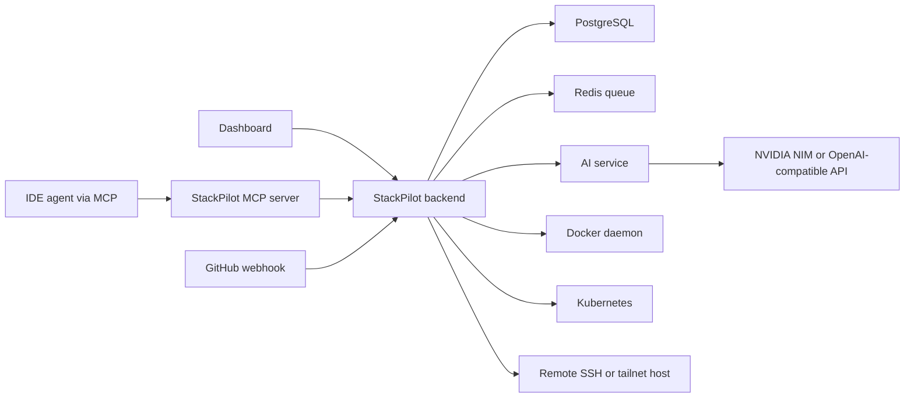

# Architecture

StackPilot is split into a control plane, a dashboard, an AI service, an MCP bridge, and runtime integrations.

## Services

- `backend`: C++ Drogon API server, build queue worker, deployment controller, runtime cleanup engine, webhook receiver, MCP token APIs.
- `frontend`: Next.js dashboard for projects, deployments, AI, logs, monitoring, settings, SSH connections, and MCP tokens.
- `ai-service`: FastAPI service that talks to NVIDIA NIM or OpenAI-compatible providers.
- `mcp-server`: Node.js MCP server that lets IDE agents deploy local or GitHub projects through StackPilot.
- `postgres`: durable system of record.
- `redis`: deployment job queue.
- `prometheus`, `grafana`, `loki`, `promtail`, `cadvisor`: observability stack.

## Request Flow

## Source Types

- `github`: backend clones a repository using public access, a connected GitHub account, or a project token.
- `ssh`: backend reads source from a saved server path.
- `local`: backend reads from allowed host-mounted local roots.
- `artifact`: MCP uploads an immutable tar archive with checksum and file count.

## Build Strategy

StackPilot first uses deterministic source detection and Dockerfile generators. If deterministic generation cannot confidently build the project, the AI Dockerfile planner can analyze the source tree and propose a Dockerfile plan. The build remains auditable through logs and stored deployment snapshots.

## Runtime Strategy

StackPilot can build only, run in Docker, deploy to local Kubernetes, deploy to remote Docker, or deploy to remote Kubernetes. Runtime snapshots record provider, image, URL, namespace, service, ingress, replicas, health path, and scheme.

## Cleanup Strategy

Deployment cleanup is shared by project delete and deployment delete. The cleanup service removes runtime resources, Docker images when requested, remote workspaces, local build workspaces, and database rows only after cleanup succeeds.
