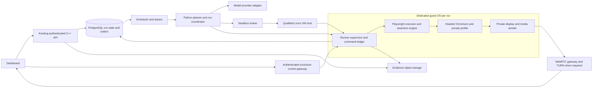

# StackPilot production browser-testing agent: engineering plan

**Status:** proposed implementation plan, September 27, 2026. No deployment or architectural implementation is implied by this document.

**Sequencing update:** the user's current priority is to improve and evaluate the existing local browser agent first. Follow [the local-first execution plan](browser-agent-local-first-plan.md) for immediate work. The VM/broker/OS isolation, image fleet, and production media infrastructure described below remain the later production destination; they are not prerequisites for local intent, execution, verification, and viewer improvements. Preserve the future boundaries while refactoring the existing services incrementally.

**Objective:** give each browser-testing run an isolated Linux OS environment, an accurate agent that can explore and complete website workflows, independently verified results, reproducible tests, and a responsive live viewer. Establish comparable browser-task success to a measured Claude computer/browser-use baseline, while making repeated validated tests substantially faster than StackPilot's current model-per-action execution.

This plan builds on `ai-agent-testing-audit.md` and `ai-agent-performance-review.md`. Earlier execution/reporting fixes and 33 passing regressions are the baseline to preserve, not evidence that this architecture already exists.

## 1. Product contract and scope

### First production release

Given a website URL, a requested workflow, test credentials/fixtures where needed, and a coverage budget, StackPilot will:

1. Provision an isolated OS sandbox and validate target access.
2. Translate the request into test cases with explicit expected outcomes.
3. Drive the website using browser interactions, escalating to fresh screenshot interpretation when DOM information is insufficient.
4. Check visible outcomes and, when explicitly configured, independently check application persistence through test APIs.
5. Explore bounded additional coverage without confusing exploration with exhaustive testing.
6. Produce an evidence-backed report, a coverage matrix, and replayable test candidates.
7. Let the user watch, stop, and take control without concurrent agent input.
8. Clean up fixtures, revoke credentials, and destroy the sandbox according to retention policy.

Supported initial surface: desktop Chromium on Linux; ordinary forms, tables, navigation, SPAs, dialogs, tabs/popups, uploads/downloads, authentication with supplied test credentials, accessible custom widgets, open shadow DOM, frame-aware interactions, and screenshot-based canvas workflows where reliable assertions are available. Every advertised feature must have a passing scenario in the capability matrix.

Modes:

| Mode | Inputs | What can be established |
| --- | --- | --- |
| Black-box website test | URL, instructions, optional credentials | Browser-visible behavior; persistence only to the extent observable through the website |
| Integrated staging test | Above plus requirements, fixture/reset APIs, optional repository test definitions | Stronger business assertions, independent persistence checks, deterministic failure injection |
| Replay suite | Previously validated, versioned workflow and fixtures | Deterministic regression results with little or no model inference |

The OS foundation may contain a terminal and file services, but unrestricted shell execution, arbitrary desktop applications, source editing, auto-deployment, and automatic repairs are outside the first browser release. Keep extension interfaces so those capabilities can be added later. Authentication challenges requiring human presence, CAPTCHA, unsupported closed widgets, and missing test data must be reported as blocked or unverified; do not claim universal support or bypass them.

“At par with Claude” means matching an agreed benchmark on task completion and false passes, not reproducing undocumented product internals. “Tests everything” means testing the declared coverage matrix and disclosing omissions. Neither phrase is a claim of universal correctness.

## 2. Research conclusions and design decisions

The following choices are StackPilot design recommendations. Documentation establishes component capabilities and constraints, not that the combined system meets its targets.

| Decision | Choice and rationale | Primary source |
| --- | --- | --- |
| Agent interface | Hybrid browser actions and selected screenshot observations. Provider-native adapters may use a trained browser/computer tool schema; retain a normalized internal contract. | [Anthropic browser use](https://platform.claude.com/docs/en/agents-and-tools/tool-use/browser-use-tool), [computer use](https://platform.claude.com/docs/en/agents-and-tools/tool-use/computer-use-tool) |
| OS boundary | One Linux VM/microVM per active independent run. Firecracker is the preferred self-hosted candidate, subject to a compatibility spike and infrastructure qualification. | [Firecracker production setup](https://github.com/firecracker-microvm/firecracker/blob/main/docs/prod-host-setup.md) |
| Container role | Dedicated hardened containers for local development and trusted CI fixtures. They do not fulfill the separate guest-kernel production requirement. gVisor is an alternative boundary, not a separate guest OS. | [gVisor architecture](https://gvisor.dev/docs/architecture_guide/intro/), [security model](https://gvisor.dev/docs/architecture_guide/security/) |
| Browser execution | TypeScript Playwright runner inside the guest, launched and owned by Playwright. Prefer the native protocol/local library over adopting the existing browser through CDP for the long-term runner. | [BrowserType connection fidelity](https://playwright.dev/docs/api/class-browsertype) |
| Correctness | Stable locators, actionability, retrying explicit assertions, independent expected outcomes, and traces. | [Actionability](https://playwright.dev/docs/actionability), [assertions](https://playwright.dev/docs/test-assertions), [trace viewer](https://playwright.dev/docs/trace-viewer) |
| Live media | Authenticated WebRTC media as the target remote-viewing path; independent reliable control/events. Validate operational cost and latency before replacing the current transport. | [WebRTC](https://www.w3.org/TR/webrtc/), [statistics](https://www.w3.org/TR/webrtc-stats/) |
| Durable runs | Extend existing PostgreSQL run/artifact records; transactional event/outbox state; Redis as scheduling acceleration rather than authoritative completion. | Existing StackPilot migrations and queue implementation |
| Performance visibility | Distributed spans plus metrics that distinguish planner, execution, assertions, queueing, and media presentation. | [OpenTelemetry traces](https://opentelemetry.io/docs/concepts/signals/traces/) |

Anthropic documents browser-oriented tools for webpage tasks and desktop tools backed by an environment operated by the application. Its computer-use reference describes virtual displays, Linux desktop components, and an observation/action loop. These support using a strong existing model with a well-engineered runtime; a new home-grown heuristic engine is not required to reproduce that general interaction pattern. API/platform availability and tool versions must be verified and pinned during provider integration.

Playwright browser contexts isolate browser storage, but that is a different boundary from tenant OS isolation. Use fresh contexts for test cases inside a dedicated run VM; never share a VM across unrelated tenants. Its Docker guide also notes that root execution disables Chromium sandboxing and recommends additional safeguards for untrusted browsing. The production runner must enable and verify Chromium's sandbox rather than copy the current `--no-sandbox` launch configuration. See [browser contexts](https://playwright.dev/docs/browser-contexts) and [Docker guidance](https://playwright.dev/docs/docker).

## 3. Target architecture



Logical components are not a mandate to create a separate service for each box. Initially combine the planner/coordinator in the existing Python service, and use one broker service plus one runner per guest. Keep the media gateway separate from model execution and from the public application control plane. Keep the broker's host privileges inaccessible to the model and guest.

**Reuse:** current C++ authentication/RBAC, frontend chat/report surface, Python provider configuration where compatible, PostgreSQL/Redis, existing telemetry stack, evidence regression tests, and deployment preview integration.

**Replace incrementally:** global `browser_manager`, the single shared X display, ad hoc action verification, heuristic completion, and the in-request long-running control loop. Do not run old and new controllers against the same browser.

## 4. Sandbox specification

### Guest image

Build a minimal supported Linux image with:

- A pinned guest kernel/root filesystem, CA certificates, required browser libraries, and deterministic fonts/locale/timezone configuration.
- A non-root runner user; a headed, pinned Chromium matching the Playwright package; Xvfb/private display and a minimal window manager only where needed.
- Node.js and the trusted TypeScript runner, fixture file storage, a media sender, and health/readiness probes.
- Per-run writable workspace, download/upload directories, temporary storage, and Chromium profile. No host filesystem bind mounts, platform secrets, Docker socket, cloud metadata credentials, or privileged device access.
- A restricted supervisor API for observe/action/assert/fixture/evidence operations. An OS tool interface can be added later without exposing broker commands.

Guest images are immutable, digest-pinned, signed, scanned, and versioned with a manifest of browser, runner, media, kernel, fonts, and provider-contract versions. Security rebuilds receive canary testing before becoming the pool default. Keep Chromium's internal sandbox enabled and verify it at image qualification. Avoid disabling normal browser features merely to make tests pass.

The Linux/Firecracker deployment requires qualified KVM-capable hosts. The current Windows Docker workspace is a development environment, not proof of production VM availability. Phase 0 must qualify actual hosting, networking, observability, upgrades, and the guest image. A managed VM backend is acceptable through the same broker contract if self-hosting requirements cannot be met.

### Runtime and network

Each run receives a unique `sandbox_id`, tenant/run binding, private profile/display/workspace, network identity, credentials, resource budget, and expiry. The broker exposes `allocate`, `status`, `extend_lease`, `terminate`, and `collect_cleanup_status`. Agent tools cannot call arbitrary host commands.

Only one input owner and one actively viewed browser workflow run in a guest at a time. Sequential test cases can use fresh contexts within that run; concurrently executed cases receive separate guests. Multiple viewers can watch one guest, but cannot create additional input owners. Do not parallelize browser mutations across contexts while streaming one foreground desktop.

All browser/guest traffic passes an enforced egress policy. Permit the target site and declared dependencies; reject loopback, link-local/cloud metadata, platform services, and unrelated private networks. Validate destination resolution and redirects, including IPv6 and DNS rebinding. WebRTC/UDP/DNS must not provide a path around the policy. Internal staging targets use a narrowly scoped connector to the approved service, not blanket access to the platform network. OWASP describes why URL validation alone is insufficient: [SSRF prevention](https://cheatsheetseries.owasp.org/cheatsheets/Server_Side_Request_Forgery_Prevention_Cheat_Sheet.html).

CDP, Playwright, VNC, guest APIs, and the hypervisor management API remain private. Use broker-mediated vsock or private authenticated channels; mTLS where network channels cross service boundaries. The guest does not receive model-provider keys. Short-lived credentials are delivered only after allocation and revoked on completion/expiry.

### Untrusted content and action policy

Treat webpage text, screenshots, downloaded files, and tool output as untrusted observations, never as instructions that can change the user's scope. Enforce target domains, fixture access, allowed action categories and budgets in trusted services outside the model. A page cannot expand an allowlist, expose platform credentials, request a new tool, or change test assertions. Screenshot/DOM prompt-injection scenarios belong in the release suite; prompt wording alone is not the containment mechanism.

Browser tasks may write only within their configured test scope. Unsupported irreversible operations, external communications, or out-of-scope targets pause with an explicit reason. Ordinary staging form writes covered by the run policy proceed without repeated approval. Runner tools receive secret references and the minimum required credential material; redact results and never pass raw provider/platform credentials to a webpage.

Validate upload/download/artifact paths, MIME and size limits, decompression limits, tenant ownership, and storage quotas. Do not execute downloaded files or generated arbitrary scripts in the trusted runner process. The initial executor accepts only the normalized action/workflow schema. A future general code-execution capability must use a separate process/security boundary with restricted credentials and must not inherit the runner's signing or broker access.

Initial resource hypotheses: 2–4 vCPU, 4 GiB RAM, and a quota-limited writable disk per live 720p browser run. These are sizing hypotheses to profile, not capacity commitments. Heavy pages, multiple tabs, and software video encoding can require more. Admission control caps per-tenant and per-host concurrency from measured CPU/memory/encoder/network demand.

### Lifecycle

`requested → allocating → initializing → ready → active → draining → destroyed`; error paths include `allocation_failed`, `unhealthy`, and `cleanup_pending`.

Maintain an idle pool of newly booted, credential-free guests for low startup latency. Assign each once and destroy it after use. Never return a previously assigned VM to the clean pool. Broker reapers reconcile leases and orphan VMs after crashes; users can see cleanup failures rather than a false “deleted” state.

**Do not clone live authenticated sessions.** Start with independently booted warm guests. Snapshot acceleration is a later optimization after uniqueness, entropy, identity, time synchronization, immutable backing storage, and connection reset are qualified. Firecracker documents clone uniqueness hazards and that network/vsock connections may not survive restore. [Snapshot support](https://github.com/firecracker-microvm/firecracker/blob/main/docs/snapshotting/snapshot-support.md), [clone randomness](https://github.com/firecracker-microvm/firecracker/blob/main/docs/snapshotting/random-for-clones.md).

## 5. Browser executor and observation contract

### Action contract

The internal normalized API is versioned, schema-validated, and small: `observe`, `navigate`, `click`, `fill`, `press`, `select`, `check`, `scroll`, `switch_page`, `upload_fixture`, `download`, `assert`, and `execute_workflow`. The provider adapter translates model tools into these actions and returns provider-appropriate results; it must not assume Anthropic's native tool protocol is OpenAI-compatible.

Each mutation carries `run_id`, `sandbox_id`, `page_id`, `navigation_epoch`, `observation_id`, `command_id`, fencing epoch, action/target, and deadline. The runner rejects stale observation references, mismatched ownership, ambiguous targets, invalid arguments, expired budgets, and old ownership epochs before acting.

Target priority: stable test ID when provided; accessible role/name or label; scoped semantic locator; bounded structural locator; fresh screenshot coordinates as a fallback. Locator repair may update how a target is reached, but cannot silently change what outcome is expected. Coordinate actions bind to a screenshot capture, viewport dimensions, device scale, scroll offset, frame/page identity, and window origin; re-observe if any mapping changes. Record actions against the same page the user sees.

Use native interaction semantics through Playwright; no duplicated synthetic events or direct DOM value assignment to mimic a user. If pointer/keyboard behavior itself is under test, explicitly choose real input sequences rather than a convenient fill operation. Assertions start after dispatch and have their own deadlines; actionability is not task verification.

### Observations

Return a structured, size-bounded browser observation with visible semantic controls, their values/checked/disabled states with secrets redacted, relevant text, URL, active page/frame, recent relevant console/network failures, screenshot reference and geometry, timestamp, and navigation epoch. Include selected screenshot images in the actual model request on visual tasks/escalation; an object-store URL in plain text is not equivalent to a model image.

Expose semantic locators/frame paths instead of relying on ephemeral numeric IDs as long-lived references. Handle popups as owned pages and cross-origin iframes through browser frame APIs, not top-page DOM evaluation. Mark unavailable information explicitly. Do not promise access to every closed shadow root or native dialog through DOM tools.

Cache only within an unchanged observation epoch. Invalidate on navigation, relevant DOM replacement, resize, scroll for coordinate actions, and takeover. Preserve images at a model-supported size with documented coordinate transforms. Maintain an on-demand unredacted pixel observation only where required for the authorized workflow; sensitive artifacts and model disclosure obey tenant policy.

### Batches

Compile short local action/assertion sequences. Start with a configurable cap of eight mutations per batch; that is an engineering default, not a universal optimum. Resolve locators immediately before each action. Stop on failed assertions, unexpected navigation/popups, ambiguous targets, or cancellation. Return every executed step plus the stopped point; never label skipped steps completed.

## 6. Durable planning, recovery, and takeover

Use one coordinator state machine:

`queued → provisioning → planning → executing ↔ verifying → reporting → terminal`.

Additional states: `recovering`, `human_control`, `blocked`, and `cancelling`. Terminal outcomes: `passed`, `failed`, `incomplete`, `cancelled`, and `infrastructure_error`. A failed business assertion is distinct from provider/sandbox infrastructure failure. A completed run can contain failed test cases; do not conflate orchestration completion with all tests passing.

The planner receives the user request, requirement IDs, policy, available fixture secrets by reference, current coverage, and fresh observations. It proposes versioned test plans consisting of preconditions, actions, expected assertions, cleanup, and budgets. Novel workflows use a strong reasoning/vision model. Local execution or deterministic replay handles known steps. A cheaper model is enabled only after scenario evaluation shows an acceptable quality tradeoff.

For the first quality baseline, integrate a supported Anthropic browser/vision model through its native API when account access permits, then evaluate it with the same tool contract used for the comparator. Keep the NIM/OpenAI-compatible lane for cost and portability, but do not assume its current default matches the reference model's reasoning. Pin evaluated model/tool versions and capability tests; provider failover must use an approved equivalent lane or stop explicitly rather than silently switching quality or modalities.

The current regex micro-decision engine becomes an optional library of narrowly validated workflow handlers; remove universal/confidence marketing from its execution decisions. The crawler becomes bounded discovery that feeds the same plan and coverage state, not a second autonomous controller.

Persist run state and command intents before dispatch. The runner keeps a command ledger for deduplication. Use at-least-once job delivery, worker leases, fencing tokens enforced at the runner, and a transactional outbox. Do not claim exactly-once website side effects: a crash between submission and acknowledgement can leave the outcome unknown. Reconcile that state with explicit postconditions; never blindly repeat non-idempotent operations.

Cancellation is durable, interrupts provider requests and pending assertions, stops new dispatch, revokes the runner lease if needed, and eventually destroys the sandbox. Record in-flight uncertainty and cleanup state. Browser disconnection or closing the dashboard does not cancel a run unless the user explicitly requests it; reconnects replay persisted events by sequence.

Takeover acquires an exclusive input lease. Pause agent dispatch, drain or mark in-flight operations, increase the ownership epoch, and reject stale commands. Human cursor/input is applied only by the controlled runner channel. On return to the agent, capture fresh state and replan; do not continue a pre-takeover coordinate script.

Recovery is bounded: retry transient read/observe operations; re-resolve ambiguous/stale locators; replan on unexpected state; restart a failed browser only with recorded state-loss consequences. Escalate after a configurable number of recoveries, repeated identical failures, or exhausted wall-clock/token/action budget. No invisible infinite loops.

Proposed initial defaults for one exploratory workflow: ten minutes wall clock, 200 mutations, 20 model requests, at most two recoveries for one failed step and five overall. Assertion deadlines default to five seconds for local UI and thirty seconds for declared server-backed operations, with tenant/workflow overrides. Suite runs have separate case and aggregate budgets. Enforce provider spend limits from recorded usage and reserved per-request allowance; no unbounded requests after the budget expires. Tune these defaults against the baseline rather than using the existing 180-second crawl limit for every task.

## 7. Test correctness, coverage, and repeatable suites

### Assertion model

Every test case has requirement IDs and independently stated expected outcomes. Examples include exact text/value/quantity, visibility or absence, authenticated identity, URL and page state, an expected error, a relevant response status/schema, download contents, and persisted record identity through a configured test API. A screenshot or DOM delta alone is supporting evidence.

Statuses per assertion: `passed`, `failed`, `unverified`, `blocked`, or `skipped`, with expected/actual values, timestamps, retries, and evidence references. A test passes only when required assertions pass and preconditions were established. An expected validation error can be a passing negative test; an unrelated console warning is not automatically a failed business case. Define error severity and relevance explicitly.

The report is generated from recorded outcomes. A model may summarize results but cannot create passing assertions, suppress a failed assertion, or rewrite expectations after seeing a failure. No assertions means incomplete coverage. Fixture cleanup failures are visible and can block a clean run result.

### Coverage and fixtures

Inventory requirements, app routes/roles, and existing tests when available. Build a finite matrix: happy paths, invalid inputs, permissions/roles, persistence, navigation, uploads/downloads, failure handling, responsive layouts, accessibility, and selected visual/performance checks. Route discovery is exploratory coverage, not proof of business coverage. Avoid denominator inflation from duplicate buttons or retries.

Use per-run test identities/data namespaces, deterministic fixture creation/reset, cleanup, and backend fault injection in staging. Respect test API scopes; do not require platform production database credentials. Read-only public-site audits use a constrained mode and report unavailable writable coverage.

Generated replay candidates contain parameterized locators, assertions, fixture setup/cleanup, required capabilities, suite version, app build ID, runner/image version, and evidence provenance. Validate them independently on clean state before promotion. Export Playwright tests plus a JSON manifest; keep assertion approval separate from selector repair. A healed selector must still satisfy the original intended target and outcome.

### Example normalized workflow

```json
{
  "schema_version": 1,
  "case_id": "cart.quantity-persists",
  "requirement_ids": ["CART-02"],
  "fixture": "cart-with-test-user",
  "steps": [
    {"action": "click", "target": {"role": "button", "name": "Add to cart"}},
    {"action": "assert", "expected": {"test_id": "cart-quantity", "text": "2"}},
    {"action": "navigate", "destination": "reload"},
    {"action": "assert", "expected": {"test_id": "cart-quantity", "text": "2"}}
  ],
  "independent_checks": ["fixture-api.cart-quantity-equals-2"],
  "cleanup": "delete-run-fixtures"
}
```

This is an illustrative domain contract, not a claim that the current tool API accepts it. The fixture must establish quantity one before the single add action. Implement a validated schema with typed assertion targets/values and explicit assertion deadlines.

## 8. Media, recording, and precise input

The OS display captured for a run must be the display containing its active agent page. Switching pages/windows is an explicit runner action that updates both active input and viewing state. For page screenshots, verify a deterministic viewport-to-display mapping; screenshots taken for model reasoning must not be confused with a different foreground desktop.

Target pipeline: guest display → low-latency encoder → authenticated WebRTC transport → browser video element. Control uses a separate reliable authenticated channel; progress/evidence events use resumable SSE/WebSocket events. Implement short-lived scoped signaling/viewer/control tickets, origin validation, session ownership, expiry, revocation, and TURN credentials. TURN/SFU/public media endpoints do not expose debugging or input APIs.

Start at 1280×720, up to 60 FPS on the reference profile, adaptive bitrate/resolution/frame rate under congestion. Preserve readable text; a smooth but unreadable stream is a failure. Do not promise fixed 60 FPS on every client/network. Freeze/jitter/drop telemetry must remain truthful when degraded. Hardware encoding is optional after profiling; a Firecracker guest does not automatically provide GPU passthrough.

Use an established maintained media stack rather than inventing RTP, congestion control, or H.264 parsing. Phase 0 benchmarks a GStreamer/WebRTC-based candidate and a maintained gateway/SFU option; select one ADR based on local/TURN latency, scaling, update cadence, license, recording, and operations. A single-viewer deployment need not start with an SFU. Recording is a separate requirement: produce valid segmented media with timestamps and verify playback/download, including reconnects. Playwright trace is primary interaction evidence; video is supporting evidence.

Until migration, repair the existing stream with bounded per-client queues, keyframe-safe loss recovery, decoder queue bounds, codec negotiation/fallback, accurate painted-frame counts, and bounded reliable-control queues. Do not activate the dormant worker without fixing and testing its H.264 rendering behavior. Failure of the viewer does not imply failure of the test executor.

Measure capture→encode→receive→decode→present and input dispatch→first relevant visible response. Correlate sequence/capture IDs and estimate clock offsets; client `Date.now()` minus a server receive timestamp is not a valid end-to-end latency measurement. Use a controlled animation and click-response fixture to establish ground truth. WebRTC statistics expose useful transport/decode/jitter counters, but actual presentation needs client frame callbacks/telemetry and benchmark validation.

## 9. API, persistence, and artifact contracts

Use the existing authenticated C++ API as the public boundary. Suggested additive endpoints:

| Endpoint | Purpose |
| --- | --- |
| `POST /api/v1/browser-test-runs` | Validate request, scope, quota and idempotency key; persist run; enqueue |
| `GET /api/v1/browser-test-runs/{id}` | Durable status, coverage and summary |
| `GET /api/v1/browser-test-runs/{id}/events` | Sequence-based event replay and live progress |
| `POST /api/v1/browser-test-runs/{id}/cancel` | Persist cancellation and trigger interruption |
| `POST /api/v1/browser-test-runs/{id}/viewer-ticket` | Issue short-lived view-only signaling access |
| `POST /api/v1/browser-test-runs/{id}/takeover` | Acquire exclusive human control |
| `POST /api/v1/browser-test-runs/{id}/resume` | Release human lease, re-observe and replan |
| `GET /api/v1/browser-test-runs/{id}/report` | Structured assertions and coverage |
| `POST /api/v1/browser-test-runs/{id}/suite-candidate` | Generate or retrieve a replay candidate |

Do not add a duplicate identity system. Enforce organization/project/run ownership at each endpoint and at downstream channels. Use short-lived secure cookies or scoped tickets where browser transports require them; never embed the service's permanent token in frontend code or URLs.

Extend `ai_runs` rather than inventing a competing run ID. Proposed additions/tables, with explicit migration design before implementation:

- `browser_test_runs`: run ID FK, organization/project, target/policy, build/suite/schema versions, state version, budgets, fixture references, sandbox binding, cancellation and cleanup status.
- `browser_test_cases`, `browser_test_steps`, `browser_test_assertions`: expected/actual results and evidence provenance.
- `browser_run_events`: per-run monotonic sequence, redacted event payload, timestamp; unique `(run_id, sequence)`.
- `sandbox_leases`: broker identity, assigned host/image, owner epoch, expiry, lifecycle and resource usage.
- `agent_commands`: run/page/command ID, intent, ownership epoch, dispatch/ack/result, reconciliation state.
- `run_outbox`: atomic run transitions and pending scheduler/event delivery.
- `test_suites`/`test_suite_versions`: validated workflow candidates, original requirements, promotion status and version hashes.

Reuse `ai_artifacts` metadata, adding object-storage references, content hashes, sizes, retention policy and access classification. Keep large screenshots/videos/traces out of database text fields. Scope object keys and signed downloads by tenant/run; protect traces as sensitive artifacts, not public URLs.

Default retention proposal: seven days for routine successful-run heavy artifacts, thirty days for failed-run evidence, and longer versioned suite definitions; make these tenant-configurable and enforce deletion. Revoke credentials and remove workspace/profile state immediately after the run unless explicit same-tenant debugging retention was selected. Validate redaction of tokens/passwords in DOM/network/logs, and disclose that screenshots can still contain sensitive content requiring artifact access controls.

## 10. Performance targets and measurement

All numbers below are proposed release targets, not current measured guarantees. Freeze reference hardware, fixture workload, model configuration, browser version, network profile, region, and concurrency before enforcing them.

| Metric | Initial target and test conditions |
| --- | --- |
| Sandbox acquisition | Warm, credential-free pool assignment ready p95 ≤5 s; measure cold path separately, initial p95 goal ≤30 s |
| Ordinary local action overhead | p95 ≤300 ms for dispatch plus minimal observation on settled reference fixture, excluding application/network completion and model inference |
| Deterministic replay | Zero model requests on unchanged validated reference suites |
| Planner calls | ≥70% fewer calls than frozen StackPilot baseline on eligible familiar workflows, at non-degraded success |
| Overall speed | ≥5× median end-to-end improvement on declared eligible replay workloads versus the frozen current StackPilot version; stretch 10×; report all tasks and overheads separately |
| Model latency | Measure provider p50/p95 and timeout rates; do not promise a model response SLA without provider evidence |
| Video | 55–60 actually presented FPS during reference motion on a 60 Hz capable client, with p95 capture-to-present goal ≤150 ms on the defined local network |
| Visible input response | p95 ≤200 ms on an immediate-response fixture/local network; application/server completion measured separately |
| Cancellation | p95 new-dispatch stop ≤1 s; p95 sandbox termination ≤10 s on healthy broker; overdue cleanup alarms |
| Admission/recovery | No tenant starvation; all expired leases reconciled within the configured watchdog interval; no duplicate side effects during crash tests |

For a congested remote profile, favor bounded latency and readable adaptive video over nominal 60 FPS. Publish separate results with 80 ms RTT, 10 Mbps available bandwidth, packet loss, TURN relay, and CPU-throttled clients; fix exact impairment profiles in benchmark configuration.

A 5–10× gain comes from deterministic replay, short local workflows, fewer model calls, reused valid observations, warm allocation, and independent-case parallelism. It is not a promise that novel tasks will execute faster than another frontier model. Preserve website user-interaction paths under test; using a backend shortcut to skip those actions would invalidate the speed comparison.

Cost accounting per run includes model input/output and image cost, VM occupancy, warm-pool idle allocation, artifacts, media egress, and TURN overhead. At 4 Mbps, one viewer receives approximately 1.8 GB/hour before protocol overhead; treat bitrate as workload-dependent. Choose per-tenant quotas and pricing only after profiling. Host capacity is the minimum allowed by measured CPU, RAM, encoder load, networking, disk and safety headroom—not RAM divided by a guessed per-run value.

## 11. Evaluation and release gates

### Independent benchmark

Maintain a versioned suite of at least 100 scenarios across several app families; five seeded runs per scenario for 500 executions per candidate. A small initial suite bootstraps development; the full gate precedes general release. Separate development tasks from held-out evaluation tasks. Grade through independent fixture assertions/data, not the agent's own report or a model judge alone.

Cover login/logout/roles, CRUD and persistence, invalid forms, autocomplete, date pickers, modal/popups, delayed SPAs, slow/error APIs, uploads/downloads, pagination, iframes, shadow DOM, canvas, resize/scroll coordinates, cancellation/takeover, provider errors, browser crashes, session concurrency, and malicious page content. Include deliberately broken app variants so false passes can be measured.

Freeze a current StackPilot baseline and a Claude computer/browser-use comparator with recorded model/tool version, prompt, configuration, fixture state, budget, region and cost. Benchmark browser-native and screenshot-only modes separately. Use the same allowed task scope and do not give one agent hidden state the other cannot access. Runs use disposable apps/data; no purchases or external messages.

Report task success, missed defects/false passes, wrong-target mutations, recovery success, flaky results, model-call count, total time p50/p95, cost, and provision/execution/verification breakdown. Use paired scenario analysis with confidence intervals; repeated seeds for one scenario are not independent task families.

Proposed parity gate: lower confidence bound on paired success-rate difference versus comparator above -5 percentage points, with no regression on critical scenarios and no weaker false-pass results. Claim parity only for this benchmark, model version, and supported scope. A small sample that cannot establish that bound does not establish parity.

### Release gates

| Gate | Required evidence |
| --- | --- |
| Safety/isolation | All ownership/auth/DNS/redirect/metadata/private-network tests pass; no cross-tenant state or screen access in concurrency and crash tests; no public debug ports; guest/host security review signed off |
| Correctness | Critical reference workflows pass all independent assertions; zero false passes on at least 300 deliberately broken executions; results do not depend on incidental page mutations |
| Reproducibility | Validated unchanged suites pass repeated clean-state runs without model inference; flaky cases identified rather than hidden by retries |
| Resilience | Worker/provider/broker/browser failures, duplicate delivery, lease expiry, lost acknowledgement, cancellation and takeover do not produce hidden success or duplicate writes |
| Media | Motion, input mapping, congestion, reconnect, unsupported codec and recording tests pass; actual presentation/latency measured |
| Operations | Staging soak ≥72 h at declared peak load, capacity/quotas verified, alarms/runbooks tested, backup/restore and artifact expiry exercised |
| Comparison | Held-out benchmark and paired success analysis meet the stated parity criterion; speed claims disclose eligible workload and baseline |

Zero false passes in a finite suite does not prove a globally zero false-pass rate. Likewise, passing a security suite is necessary but not a substitute for ongoing patching and independent review.

## 12. Repository migration and work breakdown

Proposed new paths are implementation destinations, not existing files. Keep commits independently reviewable and behind a tenant/run feature flag.

| Milestone | Work and likely paths | Exit condition |
| --- | --- | --- |
| M0: freeze baseline and qualify design | `ai-service/tests`, new `tests/agent-evals`, `docs/adr`, guest/media prototypes outside live sessions; benchmark current provider and executor; qualify KVM, image, media candidate, cost and ownership contracts | Baseline saved; 20 representative scenarios; ADRs for sandbox, runner, provider and media; successful two-guest screen/state isolation proof |
| M1: trust boundary and sandbox | New `sandbox-broker/`, `sandbox-images/`, deployment definitions; additive C++ ownership/ticket endpoints; deny legacy unauthenticated viewing; resource/egress policy | Independent guests, private endpoints, verified Chromium sandbox, credential revocation and reaper; auth/isolation tests pass |
| M2: deterministic executor | New `browser-runner/` TypeScript package with pinned Playwright, schemas, actions, assertions and traces; compatibility adapter in `ai-service/app/tools.py`/`browser_driver.py` | Existing 33 regressions retained or semantically migrated; locator/iframe/upload/negative/delayed-result cases pass; script results are truthful |
| M3: durable single coordinator | New `ai-service/app/browser_testing/` modules for contracts/coordinator/providers/observations/recovery/reporting; additive SQL migrations; C++ run/events APIs | Restart/resume/event replay work; cancellation/takeover fencing works; no crawler/micro/LLM competition; provider vision observations verified |
| M4: testing product and replay | Fixture adapters, coverage matrix, suite registry/export, independent grader; frontend report and evidence UI | Login/cart/CRUD/role/error workflows independently verified; replay has zero inference; expectation changes versioned |
| M5: media product | New `media-gateway/`, guest media sender, scoped signaling; migrate `InteractiveBrowserCanvas.tsx` and recording; use local Next.js docs before implementation | Correct session-specific video/input; motion/congestion/reconnect/recording targets measured; control remains responsive |
| M6: production qualification | Full benchmark, soak/failure/security tests, capacity, alerts/runbooks, canary and rollback | All release gates satisfied; scoped parity and speed results published |

Dependency order: M0 before choosing infrastructure; M1 before external untrusted browsing; M2 before M4; M2/M3 before autonomous beta; M1 before production media signaling. M5 can proceed alongside M3/M4 after contracts and session identity are fixed. M6 requires all earlier gates. Media perfection must not delay correcting false passes.

### Concrete initial backlog

| Ticket | Deliverable | Meaningful acceptance test |
| --- | --- | --- |
| B01 | Freeze baseline and evaluation manifest | Reproduce a baseline run with recorded config/versions and independent outcomes |
| B02 | Threat model and four ADRs | Review trust boundaries, target permissions, failure semantics and infrastructure alternatives |
| B03 | Guest image + runner health | Two independent guests launch sandboxed Chromium with private profiles/displays |
| B04 | Broker allocation/leases/reaper | Broker restart and TTL expiry remove or quarantine orphan guests |
| B05 | Egress enforcement and staging connector | DNS/redirect/IPv6/UDP attempts cannot reach unauthorized destinations |
| B06 | Public ownership/ticket APIs | Anonymous/cross-user/expired/revoked viewers and controllers are rejected |
| B07 | Normalized schema and observation epochs | Stale/mismatched/invalid commands are rejected without mutations |
| B08 | Native locator actions and fresh observations | Disabled/occluded/ambiguous controls, popup/frame ownership and screenshot coordinates work correctly |
| B09 | Explicit assertion engine | Incidental mutation cannot pass a case; expected rejection passes; delayed success waits correctly |
| B10 | Fixture reset and cleanup | Repeated runs have identical initial state and no residual records |
| B11 | Durable events, outbox and leases | Duplicate scheduling and lost acknowledgement do not silently repeat a write |
| B12 | Provider adapters and vision contract tests | Image observations reach the provider; errors/schema failures cannot be reported as successful steps |
| B13 | Single coordinator + bounded recovery | Unexpected navigation and repeated failure stop/escalate without infinite loops |
| B14 | Stop/takeover/resume | Human/agent cannot input concurrently; resumed agent re-observes |
| B15 | Evidence-backed report and coverage | Report totals match assertion records, including blocked/skipped/cleanup failure |
| B16 | Suite candidate validation/export | Replay validates on clean state; selector repair cannot erase an assertion |
| B17 | Media transport + telemetry | Real painted-frame/input benchmark, slow-client recovery, readable adaptive video |
| B18 | Recording and artifact controls | H.264 session recording plays after reconnect; cross-tenant artifact reads fail; TTL deletion works |
| B19 | Load/chaos/security/held-out eval | Release gates pass with recorded artifacts and independently graded results |
| B20 | Canary rollout and operator runbooks | Demonstrated rollback and recovery without running legacy/new inputs together |

Do not introduce Temporal, a second database, a custom hypervisor, or a newly trained model in the first implementation. Reconsider a dedicated workflow engine only if the persisted coordinator becomes difficult to operate; that decision follows evidence, not initial complexity.

## 13. Deployment, monitoring, and rollback

Separate control-plane services from sandbox hosts and media infrastructure. Existing Compose remains useful for local/trusted fixture development. Production receives explicit sandbox host registration/capabilities, broker networking, artifact storage, media/TURN routes, health probes, and secrets management. The current production Compose file does not by itself provision the proposed browser pool.

Rollout: local fixtures → isolated staging → internal users → opt-in small tenant canary → gradual rollout. Choose legacy/new runtime once at run creation and persist it. Rollback switches new allocations to the previous qualified image/runtime; active runs finish under their pinned version or are explicitly cancelled. Never fall back to the shared legacy sandbox for an untrusted production run just because the isolated pool is unavailable.

Use distributed traces for run allocation, model requests, observations, actions, assertions, evidence uploads, and cleanup. Export queue age, lease expiry, sandbox utilization, provider latency/errors, assertion failures, false-pass benchmark score, recording failures, media FPS/freeze/latency, TURN ratio, and per-run cost. Avoid tenant IDs/URLs as unbounded metric labels; keep sensitive identifiers in access-controlled logs/traces.

Alert on stuck provisioning, missing runner heartbeat, overdue cancellation/cleanup, host resource exhaustion, artifact upload failure, ticket validation spikes, queue saturation, and quality benchmark regression. Runbooks cover broker/host/provider outage, guest crash, evidence loss, credential revocation, leak investigation, drained hosts and image rollback. Restore authoritative database state and validate outbox/leases after backup recovery.

## 14. Effort and decisions still requiring qualification

Budget for a multi-milestone production project, not a prompt tweak or a single sprint. Preliminary planning range: roughly 25–45 engineer-weeks across runtime/security, agent/executor, UI/media and quality work, plus infrastructure and independent security review. A small experienced team can overlap some work, but calendar dates should be committed only after M0 measures compatibility and scope. This is an estimate, not a delivery promise.

Before production commitment, resolve these during M0: hosting/KVM availability; permitted target network scope; expected peak concurrency/regions; model/provider availability and budget; fixture/reset integration; required artifact retention; and whether Firefox/WebKit are immediate requirements. Default first release remains Chromium-only; mobile emulation is not real-device testing, and Linux WebKit results are not a blanket Safari certification.

The first implementation slice should be **two genuinely isolated sandboxes + a deterministic login/cart workflow + explicit assertions + authenticated viewing/control + independently graded evidence**. Prove this vertically before broad autonomous exploration, generalized desktop tools, or aggressive performance claims. It establishes the foundation needed for a browser agent that is fast, precise, and reviewable in production.
