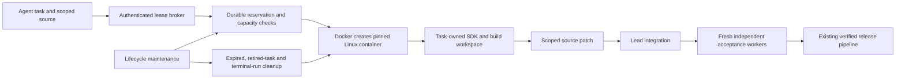

# Docker Linux instance provisioning — 1 October 2026

StackPilot provisions task-owned Linux containers through the authenticated
agent broker. Ubuntu, Debian and Alpine userspace images are admitted by an
operator-controlled registry. Custom SDK images retain their existing run-owned
immutable-image admission. Cloud allocation and native Windows/macOS execution
are separate capabilities; choosing an Ubuntu image does not provide them.

## Execution architecture

The worker can call `provision_worker_instance`, then pass the returned
`sandbox_id` to `run_worker_command`. Dependency installation and intermediate
build files survive subsequent commands. `inspect_worker_instance` observes
the actual container; `release_worker_instance` removes it. The lead cannot
execute these worker-only tools directly.

The backend independently binds requests to the authenticated user, project
administration permission, run, task, attempt, lease owner and live deadline.
The helper rechecks the task lease while commands execute. Container, image,
Docker daemon, start time, restart count and ownership labels are observed.
Different tasks, users, attempts and replacement containers cannot inherit an
instance. Actual image OS/architecture and guest `/etc/os-release` are checked.

## Persistence and recovery

SQLite lifecycle records live under `/app/uploads/agent-instances`, backed by
the existing persistent uploads mount. Atomic reservations enforce instance,
memory and CPU budgets. Operation tokens and process start identities prevent
concurrent command helpers from accepting the same instance.

A backend/service restart can reconnect to an idle instance with unchanged
identity. An interrupted command is stopped and quarantined as uncertain;
it is not replayed automatically. A container restart, revoked lease, changed
source, timeout or unimported previous patch requires reconciliation or a new
instance. Scoped patches use original digests and executable modes. Generated
files outside source scope remain in the guest and are not silently imported.

The independent maintenance loop persists expiry and terminal cleanup claims.
Working-run reconciliation also receives exact retired task attempts from the
backend database, so completed workers do not occupy quota until the full TTL.
Active unrelated instances are retained. SDK image cleanup waits for that same
run's instance cleanup to complete. Unavailable cleanup is retried.

## Defaults and controls

| Control | Development default |
| --- | --- |
| Base image | `ubuntu:24.04` |
| Other distribution profiles | `debian:bookworm-slim`, `alpine:3.21` |
| Instance memory / CPU / PID limit | 512 MiB / 1 CPU / 128 |
| Total instance count / per-run count | 8 / 3 |
| Aggregate instance memory / CPU budget | 4096 MiB / 4 CPUs |
| Maximum configured TTL | 3600 seconds; operator can raise it up to 24 hours |
| Command deadline | At most 300 seconds |

`STACKPILOT_AGENT_DOCKER_PROVISIONING` enables provisioning.
`STACKPILOT_AGENT_LOCAL_WORKERS`, admitted images/families and the existing
worker network policy still apply. Resource controls include
`STACKPILOT_AGENT_INSTANCE_MAX_TOTAL`, `MAX_PER_RUN`, `TOTAL_MEMORY_MB`,
`TOTAL_CPUS`, `MAX_MEMORY_MB`, `MAX_CPUS` and `MAX_TTL_SECONDS` under the same
`STACKPILOT_AGENT_INSTANCE_` prefix. Production keeps local task workers and
guest network disabled by default; it does not silently enable them.

Guests receive copied bounded source, no host mounts, Docker socket, platform
credentials or privileged mode. Package installation uses a fixed small set of
guest capabilities. Docker's [resource controls](https://docs.docker.com/engine/containers/resource_constraints/)
and [capability controls](https://docs.docker.com/engine/containers/run/)
bound each container. This shared local Docker adapter is not a qualified
hostile multi-tenant VM boundary. Writable-layer disk quotas, native OS workers
and hardware allocation remain separate work.

## Verification boundary

Provisioning and command execution return `verified: false`. Original tests,
frozen feature acceptance, exact-revision checks and the existing routed release
verification remain mandatory. Acceptance tasks are forbidden from using these
persistent mutable instances by both the AI runtime and backend broker.

This architecture extends Linux execution; it does not establish universal
repository compatibility or autonomous model completion reliability.

## Qualification

- 35 focused instance tests cover ownership, source fencing, scoped patch
  import, resource admission races, interruption, TTL and retired task cleanup.
- The full Linux deployment suite passed all 190 tests using the qualification
  Dockerfile with the actual Node executable and AI dependencies.
- The AI suite passed 241 executed tests out of 300; 59 optional tests skipped.
- The existing C++ regression image passed 207 checks; the updated backend
  broker was compiled successfully in the final image.
- The live fixture is `tests/integration/docker_instance_smoke.py`. It uses a
  disposable account/project, real broker/task leases and actual Docker guests.
  Its machine-readable outcome is saved to
  `docker-instance-qualification-2026-10-01.json`; only a passing record counts
  as live qualification. No model calls are made.
- The final live record passed all eight cases: real Ubuntu provisioning,
  installed Python and retained setup with scoped source import, an actual
  backend restart retaining the same container, foreign-run rejection, real
  Debian and Alpine execution/release, backend rejection of revoked execution
  and working-run full cleanup, and terminal instance removal. Fixture project
  records and all fixture instance containers were removed afterward.

Earlier failed test-environment/image snapshots are retained in the logs. The
final helper image was Python-compiled and hash-compared to the saved stable
source before live qualification. The existing calculator, club website and
portfolio records and serving runtime were preserved.
