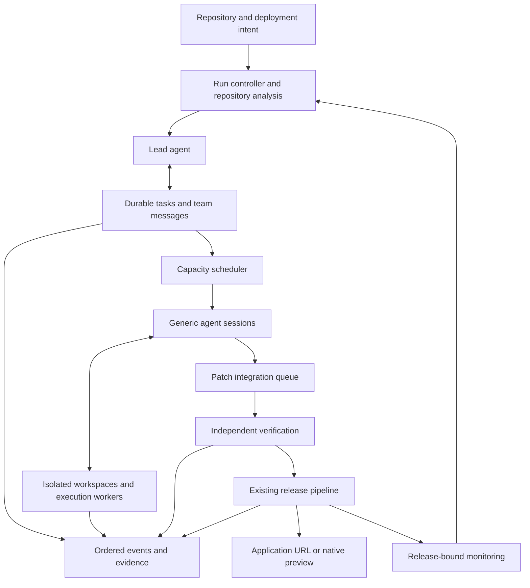

# StackPilot: autonomous repository delivery and dynamic agent teams

Date: 2026-09-29. Status: implementation underway. The initial runtime/integration unit and initial component/acceptance support are implemented; qualification and remaining phases are tracked in [the implementation status](agent-team-implementation-status-2026-09-29.md). The starting-point audit below describes the pre-implementation code. macOS/iOS execution remains deferred at the owner's request.

Follow-up recorded on 1 October 2026: the owner deferred the nine remaining
workstreams. Their current baseline, qualification requirements and information
needed to resume are saved in [the StackPilot completion plan](stackpilot-completion-plan.md).

## 1. The product outcome

The user supplies a repository or source archive and says, **“Deploy this.”** StackPilot imports the source, understands the application, determines the required environment, repairs recoverable problems, runs meaningful tests, publishes the appropriate live application or preview, and monitors the verified release. The user sees each action, its outcome, source changes and evidence as work happens.

The main agent chooses its own tasks and team. There is no mandatory Architect → Coder → Verifier lineup. It can work alone, create several independent workers, assign a temporary specialist to a specific problem, or change the task graph when new evidence appears. Each agent has a real execution session and workspace. Team members exchange messages, publish interface contracts and submit patches for integration.

StackPilot, rather than an agent's final message, decides whether a release qualifies as successful. Success requires the agreed application behavior to work at the published endpoint or native preview, using the exact source and artifacts that passed verification.

### What “handle any repository” means

The architecture should be extensible to new frameworks and toolchains without adding a fixed agent persona or a website-specific script. Existing Dockerfiles, CI scripts, package manifests, build systems and repository documentation are evidence for a build plan; they are not the only supported inputs.

It cannot guarantee that every possible repository becomes a working product without any prerequisites. Private credentials, unavailable operating systems, signing identities, proprietary dependencies, hardware and missing business requirements cannot always be inferred or manufactured. These cases become precise, resumable requirements. Recoverable source/configuration problems remain automatic.

“No conflicts” means no silent overwrites and no promotion of incompatible combined changes. Semantic conflicts still require detection and resolution. “As many agents as needed” means dynamically requested agents admitted under configurable capacity, spend and time limits; it does not mean infinite simultaneous workers.

For a library, CLI or finite batch job, the correct outcome is a tested artifact and an execution/result console. For a native app, a web preview streams the actual app running on a suitable worker. A website conversion must not silently replace a native application.

## 2. Verified starting point in this codebase

The following are code observations, not assumptions about the desired design.

| Area | Current implementation | Required change |
| --- | --- | --- |
| Subagent tool | `ai-service/app/tools.py` advertises `invoke_subagent` with a fixed role enum; its dispatcher returns `unsupported`. | Implement real asynchronous agent sessions and remove fixed persona requirements. |
| Swarm | `ai-service/app/swarm.py` constructs a fixed Architect/Coder/Verifier supervisor with in-memory context. | Replace it with a generic lead runtime, persistent task graph and scheduler. Preserve useful analysis/verification helpers. |
| Main execution | `ai-service/app/main.py` mixes model calls, tools, repair and request streaming in a large loop. Some subagent-named flags emit workflow phases, not independent workers. | Extract reusable agent execution from transport and deployment orchestration. |
| Tool execution | Repository edit tools exist. `terminal_run_command` is intentionally limited to inspection in the backend workspace, not a complete toolchain sandbox. | Route editing and process execution to the agent's assigned disposable worker/workspace. |
| Repository planning | `deployment-runtime/planner.py` supports version 1 configuration and bounded manifest discovery. It is not a complete component/dependency/data graph. | Add a validated version 2 repository plan with backward-compatible version 1 normalization. |
| Release foundation | Source snapshots, image identity, candidate verification, stable routing, release checkpoints, attempt fences and candidate cleanup already exist. | Extend these contracts rather than introducing an LLM-controlled parallel release path. |
| Repair/monitoring | Durable incident claims, monitor leases and exact-release observations exist. Structured prerequisites, complete continuation and real model healing proof remain incomplete. | Connect repair runs to the same task/evidence/release machinery. |
| Events | `tool_progress.py` provides request-local step events and post-action screenshots. | Persist run-wide events with replay and precise agent, task and runtime identity. |
| Native support | A real local Android Gradle/APK/emulator fixture is qualified. Windows GUI, generic finite jobs/packages and production native streaming remain incomplete. | Add capability-based execution adapters and qualify each lane. |
| Production execution | Shared control-plane Docker access is not a qualified boundary for hostile repositories. | Move repository execution to separate workers before offering arbitrary public repository execution. |

The detailed qualification boundaries remain in [the current remediation status](deployment-remediation-status-2026-09-29.md). Passing a local fixture is not universal repository qualification.

## 3. Architecture and ownership



There are three distinct responsibilities:

1. **Agent reasoning:** understand the repository, propose work, choose tools, diagnose failures, write patches and coordinate teammates.
2. **Trusted control plane:** authenticate ownership, enforce capabilities and budgets, schedule work, persist state, integrate patches and enforce release gates.
3. **Execution workers:** run repository code, compilers, tests, browsers and native applications in assigned environments, returning structured observations and artifacts.

Keep the existing C++ backend as the control plane and the Python AI service as the reasoning harness. A whole-service C++ migration is not a prerequisite. Model latency, build time, browser waits, repeated work and worker capacity must be measured independently before optimizing language-level overhead.

Use a provider-neutral `AgentRuntime` interface. A provider adapter handles model calls, tool-call formats, context limits, cancellation and usage accounting. An SDK can implement the model/tool loop, but it does not supply StackPilot's deployment policies, worker isolation, database or release proof. This separation follows the documented responsibility boundary in the [OpenAI Agents SDK](https://developers.openai.com/api/docs/guides/agents/sdk). Do not replace the user's selected model silently.

The lead retains run ownership. Specialists are callable asynchronous workers rather than conversation handoffs that lose the overall deployment objective. The [OpenAI sandbox agent documentation](https://developers.openai.com/api/docs/guides/agents/sandboxes) describes an agents-as-tools pattern for retaining outer orchestration; the persistent scheduler and integration design here are StackPilot-specific proposals.

## 4. Durable run, task and agent contracts

### Run identity

Every run records tenant/project/environment, original source commit, effective repaired commit, requirements revision, deployment target, authorized policy, budget, deadline, cancellation generation and current release attempt. A ZIP/local source import receives an immutable archive digest and an internal Git baseline.

Record explicit states: `queued`, `analyzing`, `working`, `integrating`, `verifying`, `releasing`, `live`, `blocked`, `failed`, `canceled`. These are proposed enum values. `live` means release verification completed; a running container or a positive agent message is insufficient.

A task records dependencies, acceptance contract, input revisions, assigned agent, workspace, execution attempt, lease, write scope, expected artifacts and status. An agent session records its parent, task, model policy, capabilities, context checkpoint and usage. A model turn and a deployment job are different records.

### Generic agent specification

An illustrative creation request, not a current API:

```json
{
  "task_id": "task-api-contract-repair",
  "goal": "Repair the API response mismatch reproduced by the checkout contract test",
  "instructions": "Preserve existing authentication and publish the updated interface contract",
  "input_refs": ["source:baseline", "test:checkout-failure", "contract:checkout-v3"],
  "requested_capabilities": ["repo.read", "repo.patch", "process.run", "tests.run", "team.message"],
  "requested_write_scope": ["apps/api/**"],
  "completion_contract_ref": "acceptance:checkout-api",
  "model_policy": "inherit-run-policy",
  "budget_ref": "run-budget"
}
```

The server attaches tenant, run, agent, workspace, base revision, attempt and effective capabilities. Arguments generated by a model cannot select another tenant, grant access to secrets or expand their own permissions. A role description may be free text; it is not a required enum or a different implementation class.

### Proposed persistence

Add migrations after the current `061_monitor_leases.sql`, with version numbers assigned during implementation. Proposed entities:

- `agent_runs`, `agent_tasks`, task dependency edges and `agent_instances`.
- `worker_registry`, worker/task leases and `workspace_leases`.
- `agent_messages`, ordered `agent_events` and a transactional outbox.
- `tool_invocations`, `patch_proposals`, verification reports and prerequisite requirements.
- Immutable source, log, screenshot and artifact references in a shared artifact registry.

Start with Postgres as the authoritative state store and Redis for wakeups, not a second owner of task state. Build on existing job/incident claim patterns. Temporal is a possible future execution adapter, not an additional competing orchestrator required for the first implementation.

## 5. Real dynamic teams and peer coordination

Expose generic team tools:

| Tool | Behavior |
| --- | --- |
| `spawn_agent` | Validates a task/specification, persists the session and returns an ID immediately. Work is asynchronous. |
| `list_agents` / `list_tasks` | Returns current run-scoped progress, assignments and artifacts. |
| `send_message` | Persists a scoped peer/lead message with sender, recipient, contract revision and optional artifact references. |
| `wait_agents` | Waits for progress/completion without busy polling or blocking other workers. |
| `revise_task` / `request_scope_change` | Changes dependencies or requests additional ownership through the scheduler. |
| `submit_patch` | Submits immutable patch evidence to integration; it does not mutate the release branch. |
| `complete_task` / `cancel_task` | Records the outcome or cancellation. Completion remains subject to its acceptance contract. |

The lead initially decomposes the discovered dependency graph. Independent investigation, distinct components and separate verification can run concurrently. Shared interfaces are agreed and versioned before dependent edits. Workers can request child tasks, but all descendants draw from the same root budget and scheduler limits.

Deliver messages and task updates at model turn boundaries. Persist decisions, unresolved questions and interface contracts instead of broadcasting entire conversations. A task can wait on a dependency without retaining an idle execution slot. Detect dependency cycles and workers waiting indefinitely for each other.

Team size is selected from available independent work, model cost, CPU/memory, worker capabilities and critical-path estimates. Use configurable per-tenant and per-run limits, fair admission and backpressure. On one Windows PC, additional agent conversations do not create additional emulator, memory or build capacity.

Claude Code documents independent teammate sessions, a shared task list and peer messaging, while also documenting coordination cost and same-file conflict risks. These public primitives are useful references; they are not proof of private implementation details or guaranteed parity. See [Claude Code agent teams](https://code.claude.com/docs/en/agent-teams). Anthropic also notes that coding dependencies can limit parallel gains in its [multi-agent research system report](https://www.anthropic.com/engineering/multi-agent-research-system).

## 6. Parallel source changes without silent overwrites

### Workspace allocation

Import once at `original_source_commit`. Create an assigned branch/workspace per task from a known integration revision. Local trusted development can use managed Git worktrees. They provide separate working directories, as documented by [Git](https://git-scm.com/docs/git-worktree), but they share repository metadata and are not a security sandbox.

For untrusted production workers, use independent guest clones or immutable snapshots. The trusted Git broker owns integration refs and credentials. Repository code must not receive a shared writable `.git`, release checkout, Docker socket or another agent's workspace.

Route existing file read/write/edit tools through an assigned workspace resolver. Validate canonical paths and symlink escapes. Writes include an expected file/base revision so stale edits cannot silently replace newer work. No worker edits the live deployment filesystem or the shared import root.

### Ownership and contracts

Use exclusive write leases for conflicting files or shared resources. File globs alone are insufficient: root lockfiles, API schemas, database migrations, shared generated output and build configuration need named resource ownership. Independent components may proceed concurrently. When two tasks need the same resource, the scheduler sequences ownership or asks the lead to redefine the tasks.

Publish versioned API/data/UI contracts with producer and consumer requirements. A contract change invalidates dependent verification until consumers have been refreshed and retested. A package dependency update and its lockfile should have one coordinated owner.

### Integration queue

Each proposal contains base commit, patch digest, affected paths/resources, contract changes, test invocation references and expected outcomes.

1. One trusted integration writer per run applies a proposal to a staging branch using compare-and-swap on its head.
2. Reject or rebase stale proposals. Rerun affected tests after rebasing.
3. Detect textual conflicts and assign a bounded conflict-resolution task when needed; do not blindly choose “ours” or “theirs.”
4. Run compatibility checks and combined integration tests. A textually clean merge is not evidence of semantic compatibility.
5. Record the resulting integrated commit and invalidate evidence that no longer applies.
6. Build the release candidate from that integrated commit, not from an agent workspace or the original GitHub head.

This last point prevents repaired files from disappearing when a deployment performs another clone. Store `original_source_commit` and `effective_source_commit` separately. Repairs are inspectable/exportable commits or diffs. Pushing them to the upstream repository is a separate target-policy action; it is not required to retain a local repair and make its application live.

## 7. A universal repository plan, not an expanding framework switch

Introduce `RepositoryPlanV2`, validated by a schema and normalized into execution contracts. Keep version 1 behavior through an explicit compatibility adapter; do not silently reinterpret existing `stackpilot.json` files.

The plan describes:

- Components and their source roots; build, runtime, data and test dependencies.
- Declared OS, CPU architecture, SDK/toolchain versions and required worker capabilities.
- Reproducible build/test/start commands, working directories, environments and deadlines.
- HTTP/TCP/gRPC entrypoints, finite jobs, package artifacts and native application identities.
- Databases, queues, caches, object stores, volumes, migrations and data ownership.
- Secret references, private registry access and signing requirements without secret values in prompts.
- Expected artifacts, release tests, readiness contracts, browser/native scenarios and preview modes.
- Production target and separate preview/testing requirements.

Analysis uses manifests, workspaces, Docker/Compose, CI, build scripts, documentation and actual diagnostic execution. Capture evidence and confidence per inference. Reconcile conflicting evidence; do not treat an inferred port as proof that an application works. Discovery is resumable and paginated rather than silently ignoring a deeply nested component after a fixed scan limit.

Build selection order:

1. Preserve a valid source-provided reproducible build.
2. Resolve declared toolchains and existing commands.
3. Use a qualified adapter or optional buildpack for appropriate workloads.
4. Let the agent generate or repair a recipe when intent is recoverable.
5. Validate and execute the recipe in a disposable worker before accepting it.

Buildpacks are useful for transforming supported application source into OCI images; they are not a universal desktop/mobile executor. Their [documented lifecycle](https://buildpacks.io/docs/for-platform-operators/concepts/lifecycle/) provides a reference for explicit detection/build/export phases.

“No hardcoding” applies to repository-specific behavior and fixed agent teams. Versioned tool schemas, adapters, resource policies and release invariants still need deterministic implementations.

## 8. A complete execution tool surface

Expose tools through a capability registry, loading relevant schemas for each task instead of sending every tool to every agent turn. Tool results use stable IDs, typed errors, observed outcome, runtime identity and artifact references.

| Tool family | Required capabilities |
| --- | --- |
| Repository | Search, read, symbols/dependencies, diff, scoped patch, source snapshot and contract inspection. |
| Processes | Start command, stream output, inspect status, cancel, deadline and resource use inside an assigned worker. |
| Build/test | Toolchain resolution, build execution, targeted/full test execution and artifact inspection. |
| Services | Provision allowed dependencies, inspect logs, health, processes, metrics, ports and test data. |
| Browser | Fresh page observation, locator/coordinate interaction, scroll, forms, dropdowns, tabs, frames, dialogs, uploads/downloads and explicit assertions. |
| Native | Actual app launch, UI observation/interaction, assertions, file/device diagnostics and preview capture. |
| Team | Task allocation, peer messages, contracts, patch submission and waits. |
| Delivery | Request candidate/release/rollback operations through the trusted backend and inspect resulting evidence. |

Heavy installation, compilation and test execution belong in the worker. Do not turn the backend's inspection terminal into unrestricted host administration. General-purpose shell/scripting inside the assigned execution environment handles unfamiliar frameworks; adapters expose the common lifecycle and result contracts.

Browser actions use fresh page/element observations, bounded recovery and explicit state checks. A covered or disabled button triggers diagnosis of overlays, validation, scroll position and application state. It is not automatically force-clicked or treated as successful. An interrupted non-idempotent form submission is reconciled before replay.

The primary research [SWE-agent paper](https://arxiv.org/abs/2405.15793) supports investing in an agent-computer interface designed for repository navigation, editing and tests. It does not establish StackPilot's reliability or deployment success rate.

## 9. Worker environments and preview coverage

Workers advertise authenticated capability, architecture, toolchain inventory, capacity and health. Assignment returns an expiring lease and workspace/session identity. Separate browser profiles, ports, displays and emulator sessions belong to separate assignments.

| Repository output | Build/test execution | Honest user-facing result |
| --- | --- | --- |
| Web/frontend/API | Linux/Windows worker as required; real service dependencies and browser/API contracts. | Actual application/API URL, verified through the route users access. |
| Android | Declared Android toolchain; build artifact; real emulator/device installation and native tests. | Authenticated stream of the running Android app and downloadable artifact. |
| Windows desktop | Isolated Windows build/run worker with GUI session and automation driver. | Authenticated remote view/control of the real application. |
| Linux desktop | GUI-capable Linux worker with display session and automation driver. | Authenticated stream of the real application. |
| CLI/job/library/package | Suitable OS/toolchain; exit, output, consumer/harness tests and artifacts. | Execution/result console and artifacts, with no invented application UI. |
| macOS/iOS | Preserve detected requirements and plan metadata. | Deferred execution until a suitable worker is added. |

Android Gradle builds produce native artifacts; the official [Android command-line build documentation](https://developer.android.com/build/building-cmdline) is the baseline for that adapter. Expo web is an additional target for compatible Expo projects, not a substitute for testing arbitrary Android code. See [Expo web development](https://docs.expo.dev/workflow/web/).

On the current PC, first qualify owned local repositories with bounded Linux Docker workers and the existing dedicated Android emulator. This is a development lane. Public arbitrary-repository execution requires separate disposable VMs or equivalent qualified isolation, narrowly scoped credential delivery, resource/egress policy and an authenticated worker broker. Native Windows execution should use a dedicated VM/worker rather than sharing the owner's interactive desktop with untrusted code.

Stateful dependencies use run-scoped disposable test instances. Production data is not a repair scratchpad. Cache keys include toolchain, architecture, lockfile and tenant/trust scope; a worker cannot overwrite another tenant's cache or release artifact.

## 10. Autonomous diagnosis, repair and prerequisites

The loop is **observe → reproduce → diagnose → assign → patch → targeted tests → integrate → independent acceptance → release → monitor**.

The agent receives actual build/test/browser/native failures and relevant source, not only a status string. It records a hypothesis and expected evidence before changing files. Targeted tests accelerate iterations, but do not replace final combined verification.

| Failure | Response |
| --- | --- |
| Missing Dockerfile, recoverable start/build configuration or script | Derive from source evidence, generate a patch, execute it and verify the intended app. |
| Dependency/toolchain mismatch or compilation defect | Reproduce on the declared environment, repair the smallest supported cause, rerun regression tests. |
| Missing implementation | Infer from existing call sites/tests/documentation when sufficiently defined; otherwise request the missing requirement. |
| Private dependency, secret or signing identity | Persist a requirement for a scoped credential reference; resume the exact task when supplied. |
| Missing OS, architecture or worker capacity | Schedule/provision if authorized, otherwise wait on a capability requirement. |
| Unavailable verifier or external infrastructure | Record infrastructure/unknown state and retry appropriately; do not rewrite healthy application source. |
| Genuine ambiguity in product behavior | Ask the smallest question needed and continue independent tasks. |
| Conflicting patches or contracts | Resolve in a dedicated integration task, then retest the combined revision. |

A requirement records its type, affected task, evidence, requested input/capability, validation method and continuation point. It is visible in the UI and resumes without restarting the whole investigation.

Ordinary authorized edits, toolchain use and rebuilds remain autonomous. Deployment authority comes from authenticated project/run policy, not prompt phrases or model-produced `approved: true` arguments. Repository guidance cannot elevate runtime privileges or remove release requirements.

Use a root retry/time/spend budget, failure signatures and progress detection. Repeated identical attempts without new evidence trigger a new diagnosis or an explicit blocked/failed outcome. Avoid endless repair loops, arbitrary sleep and repeated full image rebuilds for tiny diagnostic commands.

Never mark success by replacing the intended app with a placeholder, removing authentication, deleting failing tests, weakening acceptance or hiding runtime errors. Legitimate requirement/test changes must be explicit versioned changes, not a way for the repairing worker to grade itself.

Long-running agents need persistent progress and testable completion criteria across context resets. [Anthropic's long-running harness article](https://www.anthropic.com/engineering/effective-harnesses-for-long-running-agents) motivates this principle; the requirement ledger and execution contracts here are proposed implementations.

## 11. Meaningful end-to-end testing

Maintain an acceptance ledger outside the repairing worker's writable source tree. Each entry records requirement, workflow, expected outcome, test data/accounts, priority, scope and evidence. Preserve original failing regressions when repair begins.

For “test this website,” infer a workflow inventory from source when available, routes, navigation, UI controls and observed behavior. Discover subpages, authentication states and integrations. Report what was exercised, what failed, what was blocked and what remains unverified. A crawl or smoke render cannot establish every business requirement.

Verification layers:

1. Repository checks: relevant compilation, unit tests, lint/type checks and declared test commands.
2. Component contracts: APIs, queue consumption, gRPC/TCP, database interactions and artifact/consumer tests.
3. Combined application: frontend/API/data workflows with real disposable dependencies.
4. Browser/native workflows: expected post-action outcomes, not just successful clicks.
5. Release route: exact published origin/session and artifact identity.
6. Additional suites when required: accessibility, visual regressions, performance, security and device/platform variations.

A verification agent may discover scenarios and investigate failures. Trusted executors produce the test observations. The release gate consumes authenticated execution records bound to source commit, artifact digest, environment and acceptance revision, not a teammate's `passed` message. Repository test exit status remains distinct from independently observed product acceptance.

Tests involving email, payment, SMS, third-party login or destructive operations need authorized test accounts/data and sandbox providers. Missing external prerequisites remain visible. Monitor scenarios must be explicitly safe for recurrence; release checkout/form submissions are not replayed periodically by default.

## 12. Release, rollback and ongoing healing

Reuse the existing release pipeline:

**Integrated source snapshot → required tests → immutable artifact → separate candidate → application acceptance → stable route switch → routed verification → verified release checkpoint.**

Only the trusted release controller promotes. The lead can request promotion and investigate failure; it cannot bypass gates by changing an agent status. Evidence must match the effective repaired commit and the release attempt. Preserve the previous serving release when a candidate fails.

For multi-component applications, promote a coherent release set. Record component versions, routing and compatibility. A successful frontend image does not prove its API/database/worker combination works.

Stateful releases need explicit volume/database ownership, compatible migration strategy, backup/restore evidence, deployment sequencing and data rollback policy. Application rollback does not automatically undo a database migration. These checks are prerequisites for the stateful production claim.

Monitoring uses exact-release identity, safe business probes and healthy/failed/unknown observations. A confirmed regression creates a repair run tied to the failing release and original acceptance ledger. Repairs pass the original failure and the combined release gates before promotion. Verifier capacity loss remains unknown rather than triggering source rewrites.

Cancellation revokes pending child tasks and execution leases, with resource cleanup recorded for retry. Canceling after promotion requires an explicit release/rollback operation; task cancellation alone must not pretend the published release vanished.

Public application/native previews need TLS, authenticated scoped routing, expiring view/control permissions and revocation. A debug APK preview is not evidence that production store signing/publication is complete. Store publication, domains and production signing are separate output policies.

## 13. Recovery and exactly identifiable side effects

Checkpoint model request/result references, task progress, messages, patches, process logs, source snapshots and tool invocations. Use immutable storage outside the worker so worker loss does not erase the only repair.

Every invocation carries a run/task/attempt identifier and an operation idempotency key where the adapter supports it. Leases and generation fences prevent stale agents from editing the integration head or publishing another attempt. A leader restart resumes persisted tasks, not a fresh uninformed team.

Assume at-least-once dispatch. Ambiguous external mutations require observation/reconciliation before retry: creating a runtime, submitting a form, changing a route or publishing a package can already have occurred when a response is lost. Do not promise exactly-once side effects merely because a queue has leases. This matches the retry/idempotency distinction in [Temporal's activity documentation](https://docs.temporal.io/activity-definition).

Provide dedicated recovery tests for worker death, model timeout, lost response, expired lease, failed integration and promotion/cleanup races. Browser memory/cookies are a separate recovery concern; a tool log alone cannot recreate a browser session or safely repeat an uncertain purchase.

## 14. Live step visibility and smooth previews

Persist each action's start and result as it occurs. Event envelopes include monotonically increasing run sequence, producer/agent/task, invocation, attempt, source revision, runtime/session, URL/title where applicable, timestamp, outcome and evidence references. The sequence is replay order, not proof that concurrent workers executed in a single causal order; dependency and invocation IDs preserve causality.

Serve resumable SSE/WebSocket events with a last-event cursor. Slow/disconnected clients cannot stall worker execution. Large screenshots/logs are artifacts, not repeatedly embedded in every event. The UI displays real teammates, dependencies, patches, blockers and individual tool steps. Show concise activity explanations and observations, not hidden model reasoning or secret values.

Each screenshot belongs to the exact post-action page/session. URL, title and frame metadata must be captured from that same runtime, preventing an old IRCTC label over a portfolio image. Users can select which worker/session to view; simultaneous workers do not fight for a shared browser/display.

Separate video capture/encoding/transport from the agent's model/tool loop. Use bounded queues and prefer the latest frame under backpressure. A long model call or build should not freeze the preview. Qualify a WebRTC media path where appropriate; [WebRTC](https://www.w3.org/TR/webrtc/) supplies real-time media APIs, not an automatic 60 FPS guarantee.

The current native worker needs session/control ownership separate from video observation and long test workflows. A whole-workflow lock must not prevent viewing individual actions. Serialize conflicting input at the action/session boundary, and make manual control takeover explicit.

Measure capture, encode, network, decode and presentation separately. Count distinct presented frames, not animation-loop callbacks. Proposed LAN acceptance target: 720p at 60 presented FPS during sustained animation, with p95 input-to-visible-change below 200 ms on qualified hardware. This is a target to validate, not a current claim. PNG/JPEG fallback should report its measured rate honestly.

## 15. Speed without reducing correctness

Optimize the measured critical path:

- Cache repository indexes by source revision and reuse verified dependency/toolchain caches.
- Avoid repeated full-repository prompts; use task-relevant source and artifact summaries.
- Keep capable workers warm where economical and reuse a run's diagnostic environment.
- Run independent investigations/components concurrently; sequence shared interfaces and stateful mutations.
- Use targeted tests during repair, then retain mandatory final combined/release tests.
- Batch safe independent observations, while preserving visible individual step events and serializing dependent actions.
- Use event/readiness conditions instead of fixed sleeps and repetitive navigation.
- Cancel superseded work and stream tool output without waiting for the whole command to finish.

Benchmark a single agent and dynamic teams on identical repositories, models, acceptance tests and spend limits. Track model time, queue wait, tool time, build/test time, rework and integration overhead separately. Additional agents are justified when they improve the measured outcome. Neither language migration nor unlimited fan-out guarantees a 5–10× improvement or a 2–3 second build/release.

## 16. Implementation sequence and exit criteria

These are delivery phases, not estimated calendar promises. Each phase leaves a testable vertical slice. Public multi-tenant execution must wait for qualified isolation and release operations; local owned-repository development can proceed earlier.

| Phase | Deliverables | Required exit evidence |
| --- | --- | --- |
| 1 — Real agent runtime | Extract generic runtime/provider adapter; persistent run/task/agent records; asynchronous spawn/messages/wait; server-owned capability scope; ordered per-step events; isolated local task workspaces. | A lead creates two actual sessions, both execute tools concurrently in separate workspaces, exchange a message, and resume after service restart. No fake worker phase is displayed as a teammate. |
| 2 — Safe integration | Ownership leases, patch proposals, single integration writer, stale-base checks, conflict tasks and repaired-source continuity into builds. | Same-file/lockfile and incompatible API fixtures cannot silently overwrite or pass. Combined revision is tested. Re-cloning/building preserves accepted repairs. |
| 3 — Repository graph and toolchains | Version 2 plan with version 1 adapter; component/service/test DAG; worker capability registry; diagnostic process tools; scoped dependencies/secrets; structured prerequisites. | A nested frontend/API/database repository is discovered and executed; a missing credential/capability blocks precisely and resumes without repeating completed tasks. |
| 4 — Autonomous repair and verified release | Evidence-based repair loop; protected acceptance ledger; independent browser/API/native outcomes; connect existing candidate/checkpoint pipeline; stateful migration/rollback contracts. | A real model repairs a seeded defect and passes the original regression plus routed acceptance. A failed candidate keeps the old release. Data migration failure and rollback rules are exercised. |
| 5 — Native and non-web delivery | Windows/Linux desktop workers, finite-job/package adapters; Android capability/concurrency qualification; public authenticated preview design; independent action/video transport. | Real native app interaction and CLI/library consumer tests pass on their declared workers. Preview isolation/revocation and frame/latency measurements pass. macOS/iOS remains deferred. |
| 6 — Production qualification | Shared source/artifact storage and GC; isolated worker fleet; authenticated public routing; provenance/signing policy; fair quotas; provider-specific recovery; production observability and regression CI. | Crash/cancel/outage/isolation/load matrices pass; exact release/evidence identities survive recovery; each advertised provider/lane has live fixtures and operational runbooks. |

Phase 1 does not authorize public untrusted execution, and Phase 4 cannot claim complete stateful safety without its migration/backup/recovery evidence. Use feature flags and internal projects to extend the qualified lanes progressively.

## 17. Concrete code change map

Names in the “proposed addition” column are suggestions, not files that already exist.

| Existing area | Refactor/extension | Proposed addition |
| --- | --- | --- |
| `ai-service/app/main.py` | Keep API, authentication context and stream adapters thin; delegate model/tool turns. | `agent_runtime/runner.py`, `providers.py`, `context.py`. |
| `ai-service/app/swarm.py` | Remove mandatory fixed worker construction; adapt useful reasoning helpers into normal tasks. | `agent_runtime/team.py`, `task_planner.py`. |
| `ai-service/app/tools.py` | Replace unsupported fixed-role tool; route tools via server-issued actor/workspace context and capability registry. | `agent_runtime/tool_registry.py`, `actor_context.py`. |
| `ai-service/app/tool_progress.py` | Emit durable run events and artifact references alongside live transport. | `agent_runtime/events.py`, outbox consumer. |
| `ai-service/app/deployment_incidents.py` | Resume a persistent repair run and typed requirements; retain incident/monitor ownership. | `agent_runtime/requirements.py`, recovery handlers. |
| `ai-service/app/testing_runtime.py`, `release_scenarios.py`, `runtime_verification.py` | Maintain explicit outcomes; add protected acceptance ledger and component/native coverage. | Verification contract service and scenario inventory. |
| `deployment-runtime/planner.py` | Preserve version 1; validate/normalize version 2 and component dependencies. | Versioned plan schema, toolchain resolver and adapter contracts. |
| `src/services/BuildService.cpp` | Build the integrated repaired commit; preserve immutable snapshot/artifact and test identity. | Source/patch broker and integration coordinator. |
| `JobQueueService.cpp`, `JobQueueMaintenance.cpp`, `DeploymentOperations.cpp`, `ReleaseCheckpointService.cpp` | Connect agent runs to existing job attempts and verified releases; durable mutation/recovery contracts. | Backend agent-run/task/workspace endpoints and lease services. |
| `RuntimeObservationController.cpp`, `BrowserTicketController.cpp` | Extend release-bound evidence and scoped worker/preview capabilities. | Worker registration/assignment and preview routing adapters. |
| `native-worker/android_worker.py`, browser sandbox | Separate input/session ownership from streaming; allocate distinct leased runtime identities. | Common worker protocol, Windows/Linux desktop adapters, finite-job executor. |
| `frontend/src/lib/stream-agent.ts`, `ui/subagent-block.tsx`, `InteractiveBrowserCanvas.tsx` | Real agent/task views, resumable action stream, source/evidence identity and measured preview state. | Run graph, prerequisite/resume UI and patch/coverage views. |
| `sql/migrations/` and tests | Add durable orchestration entities after current migrations; qualify boundaries and recovery. | Schema migrations, contract tests and live repository fixtures. |

Do not replace current release gates while extracting the runtime. Keep compatibility fixtures for existing web, browser authorization and Android flows. Address the documented frontend lint failures before calling the complete platform production-ready.

## 18. First complete demonstration

Use a deliberately broken frontend/API/database repository with a recoverable build configuration defect and an API/UI contract mismatch. It is a fixture to demonstrate generic behavior, not a special-case production recipe.

The user says **“Deploy this repository.”** The lead analyzes the actual source, establishes the expected workflow, and chooses independent investigation/repair tasks. Agents execute in separate workspaces, coordinate an interface revision and submit patches. The integration queue resolves their combined source. Independent tests exercise the real UI/API/database workflow, then the existing pipeline publishes and verifies the routed application.

During the run, kill one worker. Completed evidence and accepted patches remain available; the replacement resumes under a new fenced attempt. Also inject a conflicting patch and missing test credential: neither can produce a false green release. Supply the credential reference and continue the blocked task.

The final user result includes the live URL, exact deployed commit/artifacts, inspectable repair diff, test/coverage evidence, actual team activity and monitoring state. It must be clear which work completed automatically and which requirements remain unresolved.

## 19. Qualification matrix and operating metrics

Keep unseen repositories in the evaluation set rather than teaching the system only its fixtures. Required categories include:

- Valid projects and missing Dockerfile/build/start scripts; dependency/version mismatches; broken SPA assets and runtime configuration.
- Deep/nested monorepos, multi-service contracts, database migration/backup failures, worker/queue behavior and private dependencies.
- Actual Gradle/native Android, Windows/Linux desktop and CLI/job/library consumer execution; macOS/iOS explicitly excluded until qualified.
- Browser overlays, scrolling, custom dropdowns, multi-step forms, navigation, frames, dialogs, downloads and authenticated states.
- Parallel same-file/lockfile changes, stale contracts, lost leases, agent/provider failure, budget exhaustion and canceled child work.
- Crashes during integration, runtime creation, promotion, rollback and cleanup; ambiguous tool responses and idempotency reconciliation.
- Cross-project/tenant access, workspace path escapes, forged capabilities/evidence, preview leakage and repository attempts to weaken verification.
- Concurrent builds/model calls with active preview motion, poor network, slow clients and worker capacity loss.

Track original-regression repair rate, unseen-repository completion rate, false-success rate, requirement interruptions, integration conflict/rework rate, cost, p50/p95 critical-path latency and recovery time. For streaming, track unique presented FPS, freeze duration and input-to-visible-change latency. Publish denominators and qualified workload/hardware/provider scope with every result.

The launch standard is no false success in the required qualification fixtures, complete release identity/evidence, recoverable durable state and acceptable measured SLOs. No finite test matrix justifies advertising 100% success on every future repository or complete correctness of every website.

## 20. Decisions to carry into implementation

1. Build real dynamic sessions and durable coordination first; do not add more fixed subagent labels.
2. Preserve the existing verified release path and exact source/artifact identity.
3. Make isolated patches, versioned contracts and one integration writer the default collaboration path.
4. Provide general worker execution plus extensible toolchain/workload adapters, not framework-specific agent personas.
5. Keep acceptance evidence independent of the repairing agent and bind it to the final combined release.
6. Resume missing prerequisites and interrupted tasks precisely; do not manufacture success.
7. Separate previews/events from model execution and measure actual speed and frames.
8. Defer macOS/iOS execution while retaining its capability metadata.

The first implementation unit is Phase 1 together with the minimum Phase 2 integration contract. That creates the real engineering-team foundation on which universal repository repair and delivery can be qualified.
